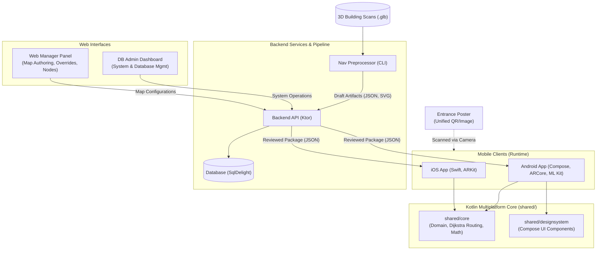
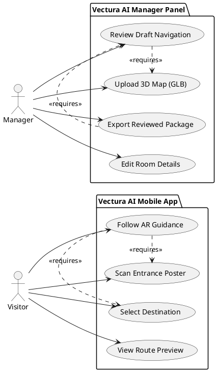
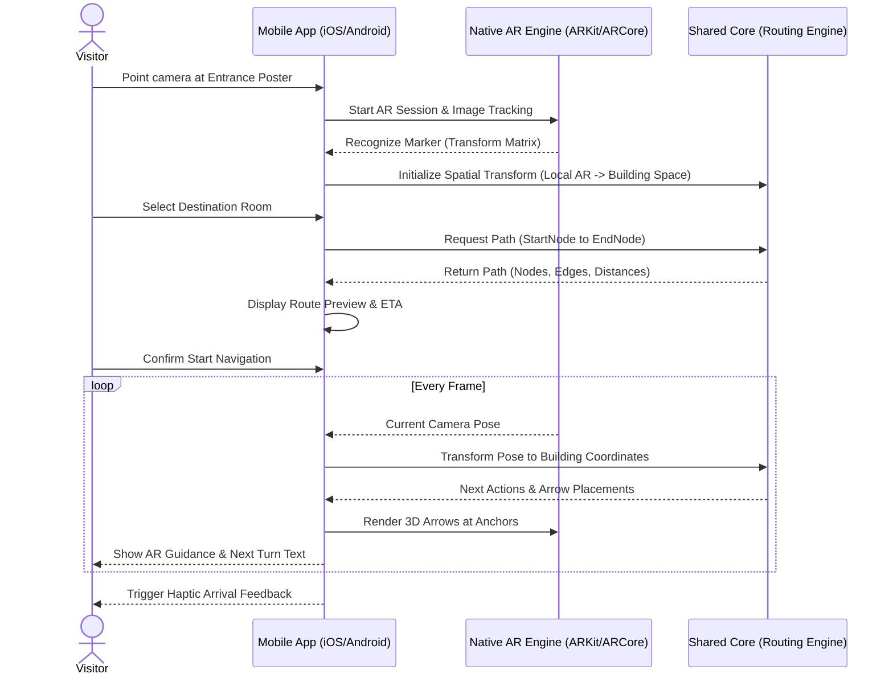
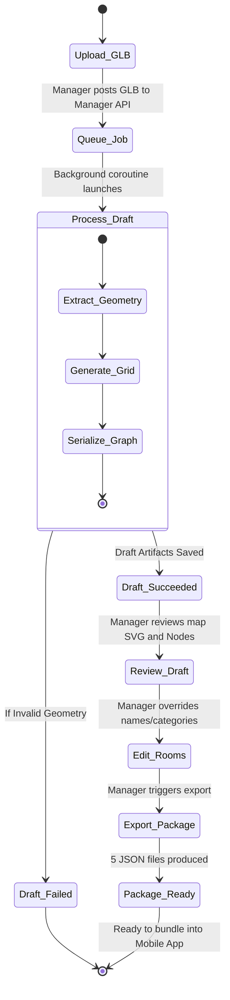
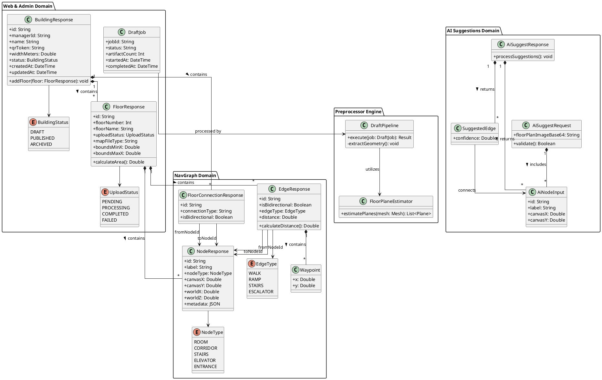

# Vectura AI Project Diagrams

This document contains the Mermaid.js diagram codes that model the architecture and flows of the Vectura AI platform. You can render these diagrams in any markdown viewer that supports Mermaid (like GitHub, GitLab, or the Notion app).

## 1. Architecture Diagram
This diagram illustrates the macro-architecture of Vectura AI, showing how the Kotlin Multiplatform shared core interacts with native clients, and how the preprocessing backend feeds navigation data to the system.

## 2. Use-Case Diagram
This diagram shows the primary actors (Visitor and Manager) and the core interactions they have with the Vectura AI platform.

## 3. Sequence Diagram (AR Navigation Flow)
This diagram maps out the runtime interactions when a visitor initiates navigation, highlighting the delegation of work between the UI, native AR engines, and the shared Kotlin routing engine.

## 4. Activity Diagram (Map Preprocessing & Manager Flow)
This details the manager workflow for ingesting a raw 3D scan and refining it into a fully deployable navigation package.

## 5. UML Class Diagram (Core Domain Models)
This diagram illustrates the core data structures used in the Vectura AI platform to represent buildings, floors, and the navigation graph (nodes and edges).

