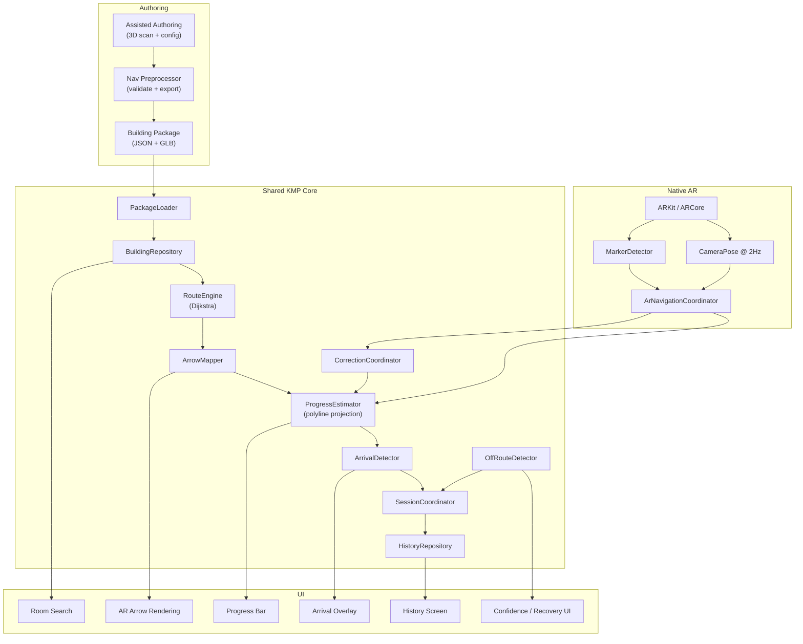

# Architecture Summary

Concise architecture overview for team handoff and technical review.

## System Diagram



## Component Roles

| Component | Role | Platform |
|-----------|------|----------|
| Nav Preprocessor | Validates authoring config, exports package | JVM (CLI) |
| PackageLoader | Loads/deserializes building package JSON | KMP shared |
| RouteEngine | Dijkstra shortest path on nav graph | KMP shared |
| ArrowMapper | Converts route waypoints to 3D arrow positions | KMP shared |
| ProgressEstimator | Projects AR pose onto route polyline | KMP shared |
| CorrectionCoordinator | Bounded alignment correction from checkpoints | KMP shared |
| OffRouteDetector | Lateral deviation + confidence signals | KMP shared |
| ArrivalDetector | Threshold-based arrival (progress + distance) | KMP shared |
| SessionCoordinator | Lifecycle: start → navigate → arrive → history | KMP shared |
| MarkerDetector | Detects AR reference images, reports poses | iOS (Swift) / Android (Kotlin) |
| ArNavigationCoordinator | Bridges native AR to shared logic | KMP shared |

## Data Flow

```
Authoring Config (.json)
    → Preprocessor (validate + export)
    → Building Package (nav_graph, rooms, markers, rendering)
    → App loads package
    → User selects room
    → Dijkstra computes route
    → ArrowMapper generates 3D arrows
    → User scans marker (ARKit/ARCore)
    → AlignmentTransform: AR world ↔ building coords
    → ProgressEstimator: camera pose → route projection
    → Checkpoint corrections (optional, bounded)
    → ArrivalDetector: progress ≥ 95% or dist < 1.5m
    → Session saved to history
```

## Key Design Decisions

1. **Route-relative progress** — not absolute indoor localization
2. **Monotonic progress guard** — never regresses during forward walking
3. **Bounded corrections** — max 2m translation, 15° rotation per checkpoint
4. **Passive recovery** — recommendations, never auto-cancel
5. **Single source of routing truth** — Dijkstra on authored nav graph
6. **Platform-neutral core** — all logic in KMP, native layers are thin
